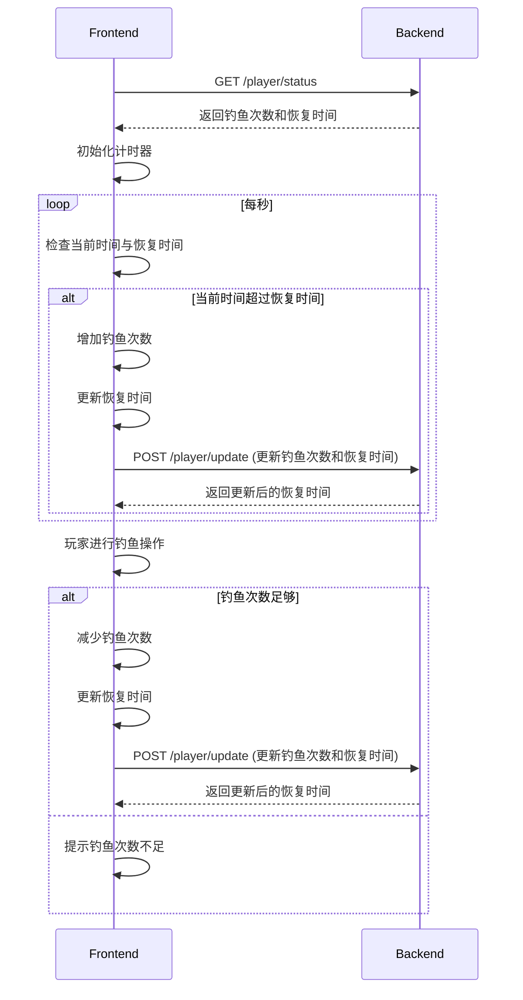

# 钓鱼游戏开发设计

## ChatGPT:
好的，我们将详细总结前端和后端的逻辑，并根据你的需求细化每个步骤。

### 前端逻辑

#### 1. 初次加载时获取玩家状态

**功能**：获取玩家当前钓鱼次数和下一次恢复时间。

**实现**：
- 在应用启动时，通过HTTP请求发送到后端获取玩家状态。
- 将返回的钓鱼次数和恢复时间存储在前端状态中。

**代码示例**：
```csharp
private async Task FetchStatus()
{
    using (HttpClient client = new HttpClient())
    {
        HttpResponseMessage response = await client.GetAsync("http://localhost:5000/player/status");
        response.EnsureSuccessStatusCode();

        string responseBody = await response.Content.ReadAsStringAsync();
        var status = JsonSerializer.Deserialize<StatusResponse>(responseBody);

        fishingTimes = status.FishingTimes;
        nextRecovery = DateTimeOffset.FromUnixTimeSeconds(status.NextRecovery).UtcDateTime;

        Console.WriteLine($"钓鱼次数: {fishingTimes}");
        Console.WriteLine($"下一次恢复时间: {nextRecovery}");
    }
}
```

#### 2. 本地计时器管理钓鱼次数恢复

**功能**：每秒更新一次倒计时，并在倒计时结束时增加钓鱼次数，同时通知后端更新状态。

**实现**：
- 使用计时器每秒检查一次当前时间与下一次恢复时间的差值。
- 如果当前时间超过下一次恢复时间，增加钓鱼次数，并发送请求到后端更新状态。
- 如果钓鱼次数达到最大值，停止计时器。

**代码示例**：
```csharp
private static async Task OnTimedEvent()
{
    DateTime now = DateTime.UtcNow;
    if (now >= nextRecovery)
    {
        fishingTimes = Math.Min(fishingTimes + 1, MaxFishingTimes);
        nextRecovery = now.AddMinutes(10);

        await UpdateFishingTimes();

        if (fishingTimes >= MaxFishingTimes)
        {
            timer.Stop();
        }
    }

    int timeLeft = (int)(nextRecovery - now).TotalSeconds;
    Console.WriteLine($"下一次恢复时间: {timeLeft} 秒");
}
```

#### 3. 钓鱼操作

**功能**：用户点击钓鱼按钮时减少钓鱼次数，并通知后端。

**实现**：
- 检查当前钓鱼次数是否大于0。
- 如果大于0，减少钓鱼次数，并发送请求到后端更新钓鱼次数和下一次恢复时间。
- 如果钓鱼次数小于最大值，重新启动计时器。

**代码示例**：
```csharp
private static async Task HandleFish()
{
    if (fishingTimes > 0)
    {
        fishingTimes--;
        nextRecovery = DateTime.UtcNow.AddMinutes(10);

        await UpdateFishingTimes();

        if (fishingTimes < MaxFishingTimes)
        {
            timer.Start();
        }
    }
    else
    {
        Console.WriteLine("没有足够的钓鱼次数");
    }
}
```

#### 4. 显示倒计时

**功能**：显示下一次恢复钓鱼次数的倒计时。

**实现**：
- 计算当前时间与下一次恢复时间的差值，显示剩余秒数。

**代码示例**：
```csharp
private static void DisplayCountdown()
{
    int timeLeft = (int)(nextRecovery - DateTime.UtcNow).TotalSeconds;
    Console.WriteLine($"下一次恢复时间: {timeLeft} 秒");
}
```

### 后端逻辑

#### 1. 获取玩家状态

**功能**：返回玩家当前的钓鱼次数和下一次恢复时间。根据上次存储的状态和当前时间，计算实际的钓鱼次数和下一次恢复时间。

**实现**：
- 从数据库或内存中获取玩家的钓鱼次数和恢复时间。
- 根据当前时间和上次恢复时间，计算离线期间应恢复的钓鱼次数。
- 更新数据库中的钓鱼次数和恢复时间。
- 返回更新后的钓鱼次数和恢复时间给前端。

**代码示例**：
```javascript
app.get('/player/status', (req, res) => {
    const currentTime = Math.floor(Date.now() / 1000);
    let { fishingTimes, nextRecovery } = playerStatus;

    if (currentTime >= nextRecovery) {
        const intervalsPassed = Math.floor((currentTime - nextRecovery) / RecoveryInterval) + 1;
        fishingTimes = Math.min(fishingTimes + intervalsPassed, MaxFishingTimes);

        nextRecovery += intervalsPassed * RecoveryInterval;
        if (fishingTimes >= MaxFishingTimes) {
            nextRecovery = currentTime;
        }

        playerStatus.fishingTimes = fishingTimes;
        playerStatus.nextRecovery = nextRecovery;
    }

    res.json({
        fishingTimes: playerStatus.fishingTimes,
        nextRecovery: playerStatus.nextRecovery
    });
});
```

#### 2. 更新钓鱼次数和恢复时间

**功能**：更新玩家的钓鱼次数和下一次恢复时间。

**实现**：
- 接收前端发送的钓鱼次数和恢复时间数据。
- 更新数据库或内存中的相应数据。

**代码示例**：
```javascript
app.post('/player/update', (req, res) => {
    const { fishingTimes, nextRecovery } = req.body;
    playerStatus.fishingTimes = fishingTimes;
    playerStatus.nextRecovery = nextRecovery;
    res.json({ nextRecovery: playerStatus.nextRecovery });
});
```

### 接口设计

#### 接口1：获取玩家状态

- **URL**：`GET /player/status`
- **请求参数**：无
- **响应数据**：
  ```json
  {
    "fishingTimes": 5,
    "nextRecovery": 1696358400
  }
  ```

#### 接口2：更新钓鱼次数和恢复时间

- **URL**：`POST /player/update`
- **请求数据**：
  ```json
  {
    "fishingTimes": 4,
    "nextRecovery": 1696362000
  }
  ```
- **响应数据**：
  ```json
  {
    "nextRecovery": 1696362000
  }
  ```

### 整体流程图

以下是前后端交互的整体流程图：



通过这些详细的逻辑和实现，前后端可以有效地协同工作，实现钓鱼游戏的核心逻辑，并确保玩家在离线期间也能正确恢复钓鱼次数。